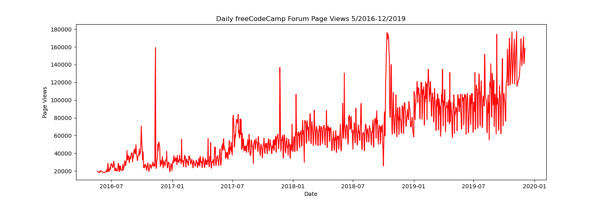
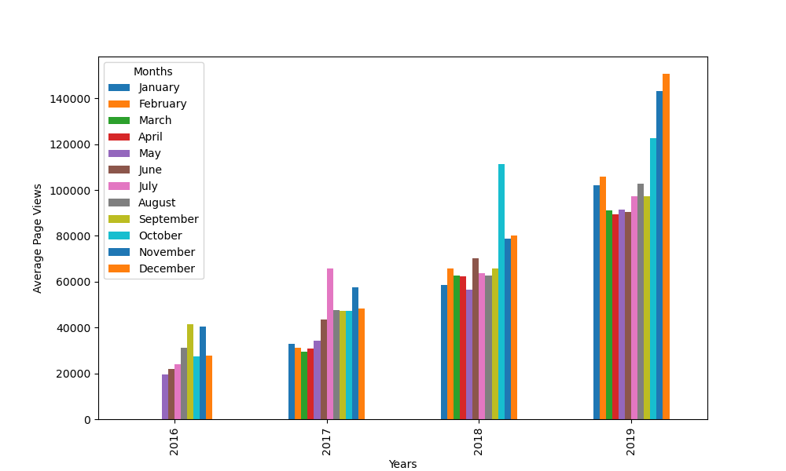
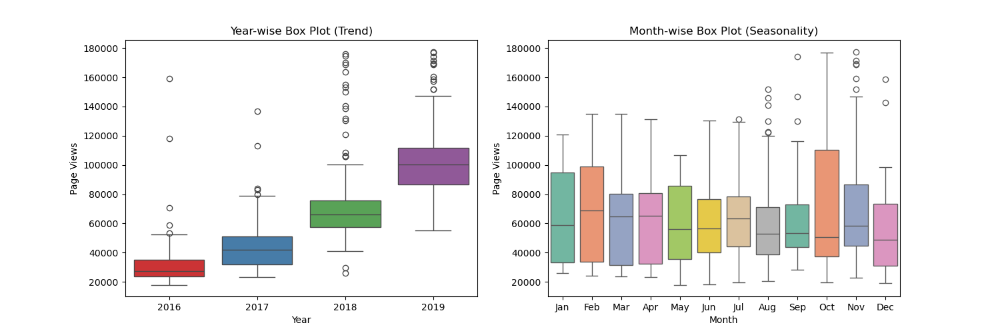

# Page View Time Series Visualizer

This project is my solution to the **FreeCodeCamp "Page View Time Series Visualizer" challenge**. It analyzes forum page view data over time and visualizes it using line plots, bar plots, and box plots. The project uses Python libraries: Pandas, Matplotlib, and Seaborn.

## Project Overview

The project provides three visualization functions:

### 1. draw_line_plot()
- Plots daily page views from May 2016 to December 2019.
- Shows long-term trends in forum traffic.
- Output is saved as `line_plot.png`.



### 2. draw_bar_plot()
- Groups data by year and month.
- Shows the average monthly page views per year as a bar chart.
- Output is saved as `bar_plot.png`.



### 3. draw_box_plot()
- Creates two box plots:
  - **Year-wise Box Plot (Trend):** shows how page views vary each year.
  - **Month-wise Box Plot (Seasonality):** shows seasonal variations across months.
- Output is saved as `box_plot.png`.



## Files

- `fcc-forum-pageviews.csv` - the dataset used (provided by FreeCodeCamp).
- `main.py` - script to run the visualization functions.
- `test_module.py` - automated tests to check correctness.
- `requirements.txt` - Python dependencies.

## How to Run

1. Install dependencies:

```
pip install -r requirements.txt
```

2. Run the main script:

```
python main.py
```

3. The plots will be saved in the current folder:
- `line_plot.png`
- `bar_plot.png`
- `box_plot.png`

## Notes

- Data was cleaned by removing the top and bottom 2.5% of values to remove outliers.
- This project was completed as part of FreeCodeCamp's Data Analysis with Python certification.
